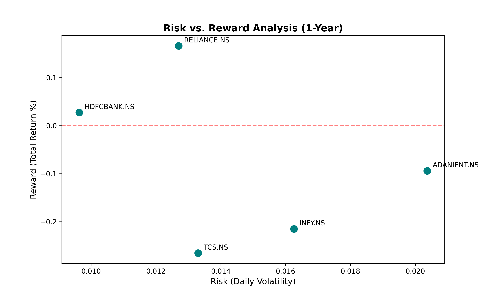

# 📈 Indian Equities Performance Tracker
A specialized Python tool designed for the comparative analysis of Indian stocks. This project solves the "Price Bias" problem by normalizing disparate share prices to a common base of 100, allowing for a true percentage growth comparison.

🚀 Key Features
Live Data Pipeline: Connects to Yahoo Finance API to pull 1-year historical data for NSE-listed companies.

Data Normalization: Uses Pandas .iloc logic to reset all stock prices to a base of 100 on Day 1.

Visual Analytics: Generates multi-line charts comparing major market players (Reliance, TCS, Infosys).

Automated Cleaning: Handles missing market data for holidays and weekends using dropna().

🛠️ Technology Stack
Language: Python

Libraries: Pandas (Data Transformation), yfinance (Market API), Matplotlib (Visualization)

🧠 What I Learned
Through this project, I mastered:

Handling real-world time-series data.

The mathematical logic behind Relative Performance Tracking.

How to manage multiple data columns in a single Pandas DataFrame.

## 📊 Result Preview


---

## ⚖️ Project 2: Risk vs. Reward Analyzer (Efficient Frontier)

While the first script tracks performance, this script calculates the **Value at Risk (VaR)** and Daily Volatility to determine if the potential returns justify the risk taken. 

**Key Skills Demonstrated:**
* **Quantitative Finance:** Calculating Daily Returns and Standard Deviation (`std()`).
* **Advanced Visualization:** Building a Scatter Plot (`plt.scatter`) to map the "Efficient Frontier."
* **Data Labeling:** Automating chart annotations so each data point is clearly identified.


*(X-Axis: Daily Risk/Volatility | Y-Axis: Total Return)*

# ⚖️ Indian Equities: Risk vs. Reward Analyzer

A live, interactive web application built with Python and Streamlit that analyzes the historical performance of Nifty 50 stocks. 

This tool automates the extraction of financial data, calculates annualized risk (volatility) and reward (returns), and dynamically plots an Efficient Frontier to help visualize portfolio optimization.

## 🛠️ The Tech Stack
* **Python:** Core logic and math engine.
* **Streamlit:** Front-end web framework for the interactive dashboard.
* **yfinance:** Live market data extraction from Yahoo Finance.
* **Pandas & NumPy:** Data cleaning, manipulation, and financial calculations.
* **Matplotlib:** Custom scatter plot rendering.

## 🚀 Features
* **Live Data:** Pulls the last 1-year of trading data instantly.
* **Dynamic Filtering:** Users can multi-select custom stocks to compare.
* **Automated Math:** Calculates daily percentage changes, standard deviations, and annualized returns automatically.
* **Interactive UI:** Features a clean, responsive dashboard with key metric callouts.

## 💻 How to Run This Locally
If you want to run this application on your own machine:

1. Clone this repository.
2. Install the required libraries:
   ```bash
   pip install -r requirements.txt
3.Launch the Streamlit server:
  streamlit run app.py

Author:Suraj Vishwakarma
Focus:Commerce + Data Analytics

